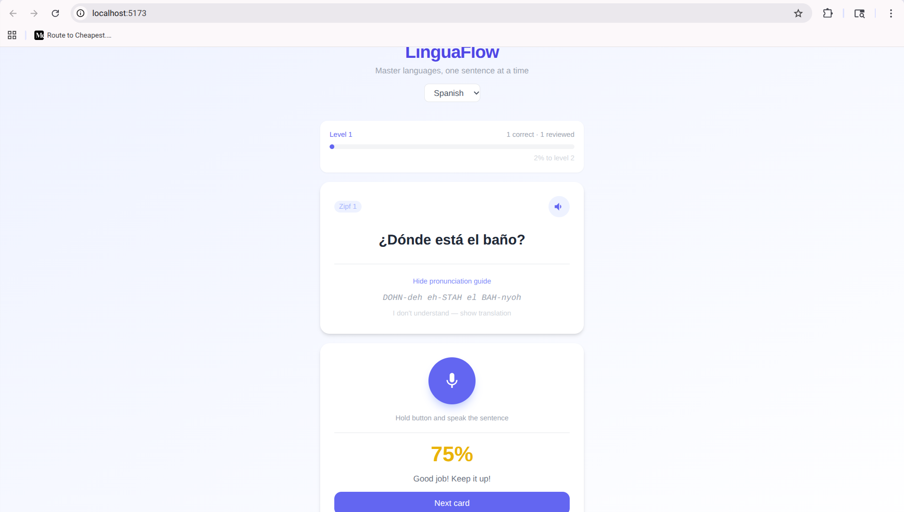
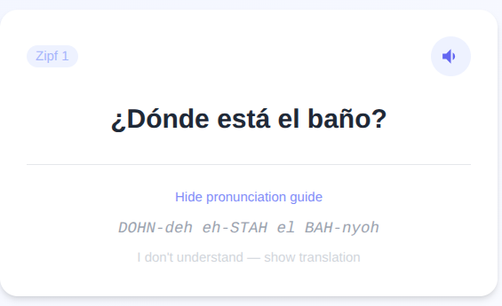
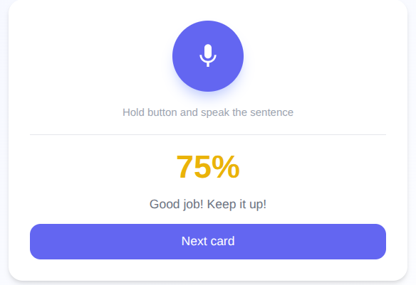

# LinguaFlow

> Master languages one sentence at a time — with spaced repetition and offline speech recognition.

<p align="center">
  
</p>

---

## Features

- **Spaced repetition** (SM-2 algorithm) — review sentences at optimal intervals
- **Pronunciation scoring** — speak and get instant feedback (0–100%)
- **Offline speech recognition** — Vosk WASM, no API keys, no data uploaded
- **Zipf progression** — unlock harder vocabulary as you improve
- **Multi-language** — Spanish, Chinese, Swedish (easily extendable)
- **Zero backend** — everything runs in the browser, progress saved locally

---

## Demo

### Card Display
See the sentence, reveal the pronunciation guide, or tap "I don't understand" for the translation.

<p align="center">
  
</p>

### Recording & Pronunciation Scoring
Hold the microphone button, speak the sentence, release — get an instant 0–100% score.

<p align="center">
  
</p>

### Progress Tracking
A level bar shows how many correct answers until the next Zipf level unlocks.

<p align="center">
  
</p>

---

## How It Works

| Step | Action | What happens |
|------|--------|-------------|
| 1 | App opens | Loads sentences from JSON, restores your progress from IndexedDB |
| 2 | Card shown | SM-2 picks the sentence due for review today |
| 3 | Listen | Tap the speaker icon to hear eSpeak-NG audio |
| 4 | Speak | Hold mic button → Web Speech API / Vosk transcribes live |
| 5 | Score | Word-overlap score (0–100%) updates ease factor |
| 6 | Next | SM-2 schedules the next review; Zipf level unlocks at milestones |

---

## Tech Stack

| Layer | Technology | Why |
|-------|-----------|-----|
| UI | React 18 | Functional components, fast |
| Styling | Tailwind CSS | Utility-first, no custom CSS |
| Speech recognition | Vosk WASM | Free, offline, private |
| Speech fallback | Web Speech API | Zero setup, Chrome/Edge |
| Storage | IndexedDB (Dexie) | Local-first, no backend needed |
| Hosting | Firebase Hosting | Free CDN, COOP/COEP headers |
| Algorithm | SM-2 | Battle-tested spaced repetition |

---

## Quick Start

```bash
npm install
npm run dev
# → http://localhost:5173
```

See [docs/SETUP.md](docs/SETUP.md) for Vosk model download and Firebase deployment instructions.

---

## Project Structure

```
src/
├── components/   # React UI components (≤ 50 lines each)
├── hooks/        # Custom React hooks (business logic)
├── services/     # Data & storage abstraction layer
├── utils/        # Pure functions (SM-2, Zipf)
└── config/       # Constants, no magic numbers
public/data/      # JSON content — edit to add sentences
screenshots/      # UI screenshots for README
docs/             # Architecture, setup, API reference
```

---

## Extending

**Add sentences**: edit `public/data/sentences_<language>.json`

**Add a language**: add to `public/data/config.json` + create a sentences file + add to `LANG_CODES` in `src/config/constants.js`

**Add audio**: drop MP3s into `public/audio/` matching `audioUrl` values in the JSON

---

## Documentation

- [Architecture Decisions](docs/ARCHITECTURE.md) — why each technology was chosen
- [Setup & Deployment](docs/SETUP.md) — installation, Vosk models, Firebase deploy
- [API & Data Flow](docs/API.md) — service interfaces and data schemas

---

## Adding Screenshots

To replace the placeholders above with real screenshots:

1. Open the app: `npm run dev` → `http://localhost:5173`
2. Take screenshots of each view (browser DevTools → device toolbar for mobile sizing)
3. Save to the `screenshots/` folder with these exact names:

| File | What to capture |
|------|----------------|
| `screenshots/main-ui.png` | Full app — card + recording panel visible |
| `screenshots/card-display.png` | Card with pronunciation guide expanded |
| `screenshots/recording.png` | Recording panel after speaking (score shown) |
| `screenshots/progress.png` | Progress bar area, level label visible |

4. Recommended size: **800px wide** for the hero, **400px wide** for feature shots
5. Commit: `git add screenshots/*.png && git commit -m "Add UI screenshots"`

---

## License

MIT
